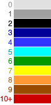

# kmer_1KG
QuicK-mer2.0 K-mer analysis of new 30x coverage 1000 Genomes Data

Load the trackhub in the UCSC browser with this link:

https://raw.githubusercontent.com/KiddLab/kmer_1KG/master/kmer-1KG.hub.txt

Files were generated using QuicK-mer2 available at https://github.com/KiddLab/QuicK-mer2

## Heat map tracks

The most useful tracks are the copy number heat maps for each sample.  These are organized by
population.  You can use the UCSC track control to select  a subset of samples to display.  
The tracks are best viewed in dense mode.  Note, that if you zoom out too far the tracks will
only display as black.

The heat map key is:

## How to load the track hub

Go to http://genome.ucsc.edu/

Click on My Data --> Track Hubs

click the 'My Hubs' tab
 
paste in this address: https://raw.githubusercontent.com/KiddLab/kmer_1KG/master/kmer-1KG.hub.txt

Click 'Add Hub'
